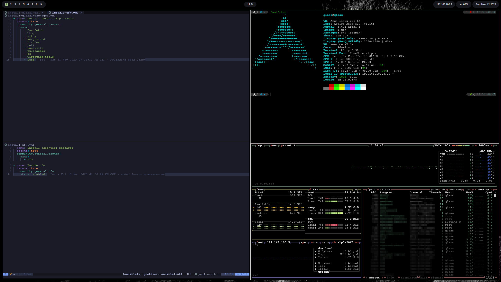

# Dotfiles

This repository contains my dotfiles,
which were created specifically for Arch Linux.



## Tools

| Tool              | Purpose       |
| ----------------- | ------------- |
| Window manager    | AwesomeWM     |
| Kitty             | Terminal      |
| Shell             | zsh           |
| Zsh theme         | Powerlevel10k |
| Editor            | LunarVim      |
| Launcher          | Rofi          |
| Python Management | Pyenv         |

## Deployment

1. Clone this repository to your home directory.
2. Install ansible.
3. Run ansible playbook via:

```bash
ansible-playbook ~/playbook.yml --ask-become-pass
```
